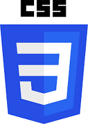

# Assignment 11
This assignment focuses on getting us know more about **Bootstrap**. I incorporated features that I learned about in this module in conjunction with some components to create an aesthetically pleasing and usable version of the Vecta Corp. site that relies entirely on Bootstrap.

## Installation
* git clone _[Github_Address][Address]_
* Open _Assignment 11_ folder
* Open _vectacorp_ folder
* Open _index.html_ file

## Credits
Dhaval Sharma (Red Id: 824654344)

)

[Address]: https://github.com/dhavalsharma97/ModernWebDevelopmentFrameworks/tree/master/Assignment%2011